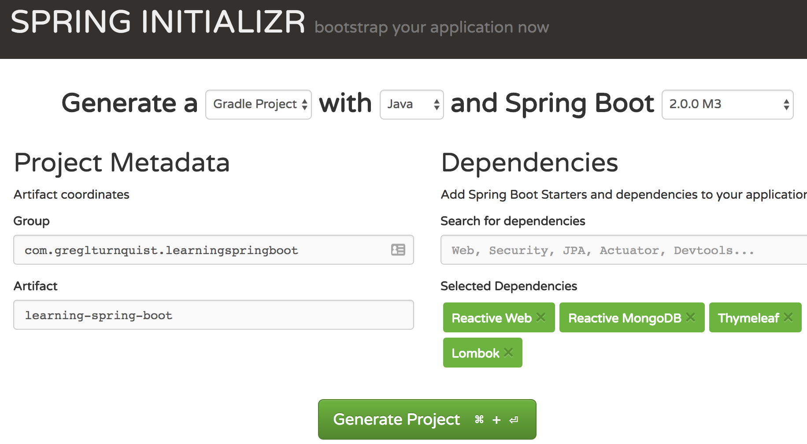

:spring_boot_version: 2.0.0.BUILD-SNAPSHOT
:spring_version: 5.0.0.BUILD-SNAPSHOT
:code: /folder/with/your/book's/code

== 1

=== Name of this chapter

[verse, Josh Long @starbuxman]
Working with Spring Boot is like pair-programming with the Spring developers.

Perhaps you've heard about Spring Boot? It's cultivated the most popular explosion in software development in years. Clocking millions of downloads _per month_, the community has exploded since its debut in 2013. 

Write some more here...

In this chapter we will cover the following topics:

* Laying out a book using Asciidoctor-to-Packt backend.
* Spit out FODT files, which can then be SaveAs'd into ODT and turned over to Packt.
* Import your code straight into Asciidoctor.

NOTE: At any time, if you're interested in a more visual medium, feel free to checkout my _Title Of My [Video]_ at https://www.packtpub.com/application-development/learning-spring-boot-video.

==== Getting Started

What is step one when we get underway with a project? We visit Stack Overflow and look for an example project to help us build our project!

Lorem ipsum dolor sit amet, consectetur adipiscing elit, sed do eiusmod tempor incididunt ut labore et dolore magna aliqua. 

INFO: Ut enim ad minim veniam, quis nostrud exercitation ullamco laboris nisi ut aliquip ex ea commodo consequat.

* Blah
* Blah
* Blah

Let's take a look, starting from the top:

[source,groovy]
----
include::{code}/1/part1/build.gradle[tag=buildscript]
----

This contains the basis for our project:

* Ut enim ad minim veniam using *{spring_boot_version}*.
* Lorem ipsum dolor sit amet.

Lorem ipsum dolor sit amet, consectetur adipiscing elit, sed do eiusmod tempor incididunt ut labore et dolore magna aliqua. Ut enim ad minim veniam, quis nostrud exercitation ullamco laboris nisi ut aliquip ex ea commodo consequat. Duis aute irure dolor in reprehenderit in voluptate velit esse cillum dolore eu fugiat nulla pariatur. Excepteur sint occaecat cupidatat non proident, sunt in culpa qui officia deserunt mollit anim id est laborum.

==== Lorem ipsum dolor sit amet

Lorem ipsum dolor sit amet, consectetur adipiscing elit, sed do eiusmod tempor incididunt ut labore et dolore magna aliqua. 

Ut enim ad minim veniam, quis nostrud exercitation ullamco laboris nisi ut aliquip ex ea commodo consequat. Duis aute irure dolor in reprehenderit in voluptate velit esse cillum dolore eu fugiat nulla pariatur.

----
include::1/revised_fragment_01.txt[]
----

NOTE: Lorem ipsum dolor sit amet, consectetur adipiscing elit, sed do eiusmod tempor incididunt ut labore et dolore magna aliqua.

Let's type the following command:

----
$ java -jar build/libs/learning-spring-boot-0.0.1-SNAPSHOT.jar
----

[options="header"]
|====
| Actuator Endpoint | Description
| `/autoconfig`     | Lorem ipsum dolor sit amet
| `/beans`          | Consectetur adipiscing elit
|====
{empty}

==== Summary

Lorem ipsum dolor sit amet, consectetur adipiscing elit, sed do eiusmod tempor incididunt ut labore et dolore magna aliqua. 

In the next chapter, we'll see how enim ad minim veniam.
